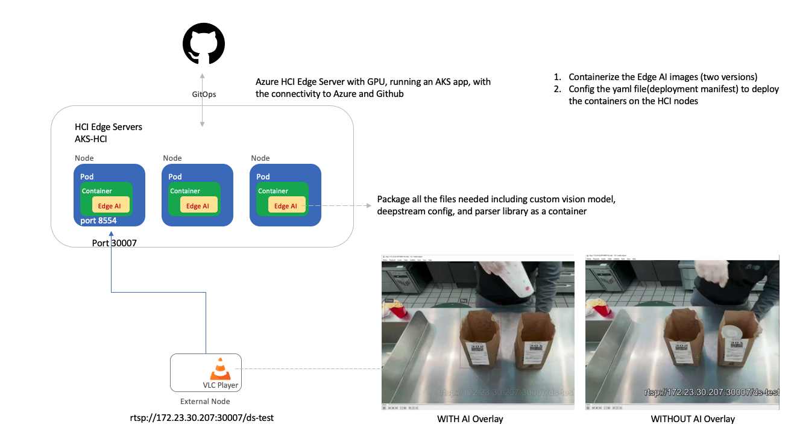
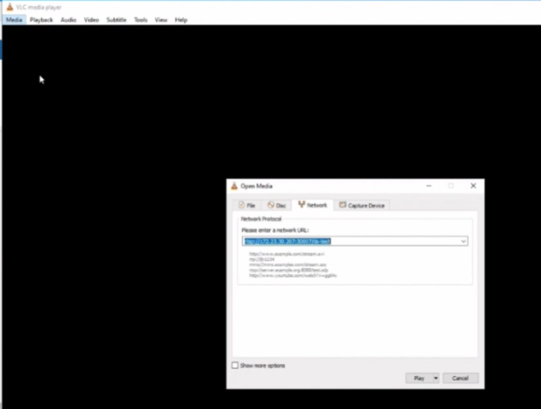
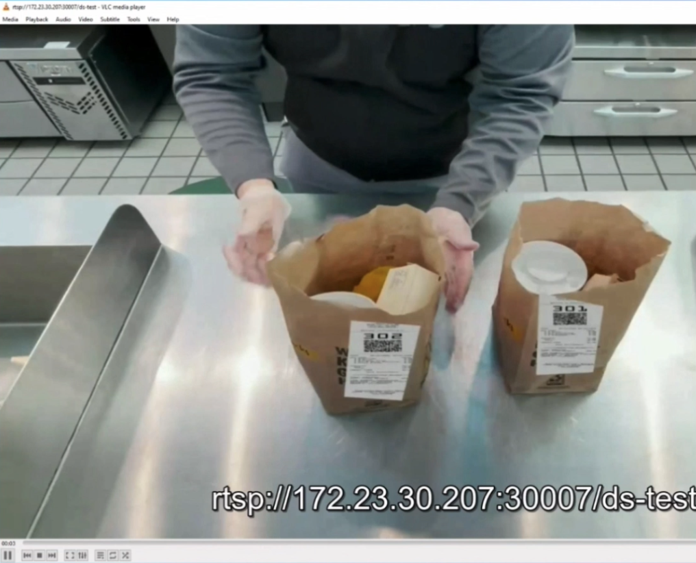
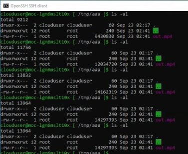

# cv-model-with-deepstream-on-kubernetes

The goal of this readme is to guide you to containerize your own model generated by Custom Vision website as an edge ai module and run on kubernetes. 

## Prerequesite
1. The video is going to be inferenced
2. kubernetes cluster with GPU support

## Architecture



## Content
| File             | Description                                                   |
|-------------------------|---------------------------------------------------------------|
| `readme`    | This readme file |
| `ai-inference-ds.dockerfile`    | The dockerfile for building the edge-ai module |
| `edgeai-file.yml`    | The k8s deployment manifest for viewing the inference video as a file |
| `edgeai-rtsp.yml`    | The k8s deployment manifest for viewing the inference video through rtsp stream |
| `MyCustomThings/config_infer_custom_vision.txt`    | The config file for edge ai module for HCI |
| `MyCustomThings/libnvdsinfer_custom_impl_Yolo_dp61_amd.so`    | The parser library of the custom vision model for HCI VM |
| `MyCustomThings/labels.txt`    | The labels file of the model|
| `MyCustomThings/model.onnx`    | The onnx model export from custom vision website  |
| `MyCustomThings/Mcdonalds_receipt_v01.MP4`    | The video is going to be inferenced |

## Steps
### Step 1 - Export your model from custom vision website
0. Clone the repository
1. Create an object detection model as in [here](https://docs.microsoft.com/en-us/azure/cognitive-services/custom-vision-service/get-started-build-detector)

2. Export your model with ONNX platform
   1. Switch to the `Performance` tab
   2. Select the `Export` button that appears
      
   3. Select `ONNX`, and then `Export`
      
   4. Once the file is ready, select the `Download` button. 
   5. Open the downloaded .zip file and extract the `model.onnx`, `label.txt` file from it. This file contains your object detection model.
   
      
3. Replace the files in the MyCustomThings folder you cloned with the files `model.onnx` and `label.txt` 
4. Config the `config_infer_custom_vision.txt`
   1. Modify that the `num-detected-classes` property maps to the number of classes or objects that you've trained your custom vision model for.  

### Step 2 - Config your source and sink in the deepstream config file
1. Config the source of the config file
   1.  Add the video you are going to inferenced in the MyCustomThings folder
   2.  Modify the source file name in the L24 [here](https://github.com/leannhuang/cv-model-with-deepstream-on-AKS4HCI/blob/main/MyCustomThings/source4_1080p_dec_infer-resnet_tracker_sgie_tiled_display_int8.txt#L24)
        ```
            [source0]
            enable=1
            #Type - 1=CameraV4L2 2=URI 3=MultiURI 4=RTSP
            type=3
            uri=file://MyCustomThings/<Your video file name>.MP4
        ```

2. Config the sink of the config file
   1. If you would like to set RTSP stream as your output to view the inference result:
      1. set property `enable` to `1` [here](https://github.com/leannhuang/cv-model-with-deepstream-on-AKS4HCI/blob/main/MyCustomThings/source4_1080p_dec_infer-resnet_tracker_sgie_tiled_display_int8.txt#L62) under the [sink2]
        ```
            [sink2]
            enable=1
        ```
      2. set property `file-loop` to `1` [here](https://github.com/leannhuang/cv-model-with-deepstream-on-AKS4HCI/blob/main/MyCustomThings/source4_1080p_dec_infer-resnet_tracker_sgie_tiled_display_int8.txt#L174) under the [tests]
        ```
            [tests]
            file-loop=1
        ```
   
   2. If you would like to output a video with inference result:
      1. set property `enable` to `1` [here](https://github.com/leannhuang/cv-model-with-deepstream-on-AKS4HCI/blob/main/MyCustomThings/source4_1080p_dec_infer-resnet_tracker_sgie_tiled_display_int8.txt#L43) under the [sink1]
        ```
            [sink1]
            enable=1
        ```
      2. set property `file-loop` to `0` [here](https://github.com/leannhuang/cv-model-with-deepstream-on-AKS4HCI/blob/main/MyCustomThings/source4_1080p_dec_infer-resnet_tracker_sgie_tiled_display_int8.txt#L174) under the [tests]
        ```
            [tests]
            file-loop=0
        ```

### Step 3 - Containerize as a edge ai module and push to ACR or docker hub
1. Create your own Azure Container Registry [here](https://learn.microsoft.com/en-us/azure/container-registry/container-registry-get-started-portal?tabs=azure-cli) or docker hub
2. Open your terminal, and cd to the path with the same hierarchy with the `ai-inference-ds.dockerfile`
3. Login to your registy
    ```
            az acr login --name <registry-name>
    ```
4. Build the edge ai docker image
        
    ```
            docker build -f ai-inference-ds.dockerfile -t <registry-name>.azurecr.io/edgeai:<tag> .
    ```
5. Push your edge ai docker image to the ACR
    ```
            docker push <registry-name>.azurecr.io/edgeai:<tag>
    ```

### Step 4 - Deploy the corresponding yaml to kubernetes
1. If you would like to set RTSP stream as your output to view the inference result:
   1. Fill in your image url in the `edgeai-rtsp.yml` file [here](https://github.com/leannhuang/cv-model-with-deepstream-on-kubernetes/blob/main/edgeai-rtsp.yml#L26)
        ```
            image: "<registry-name>.azurecr.io/edgeai:<tag>"
        ```
   2. Execute the command
        ```
            kubectl apply -f <yaml file path>\edgeai-rtsp.yml
        ```
2. If you would like to output a video with inference result:
   1. Fill in your image url in the `edgeai-file.yml` file [here](https://github.com/leannhuang/cv-model-with-deepstream-on-kubernetes/blob/main/edgeai-file.yml#L31)
        ```
            image: "<registry-name>.azurecr.io/edgeai:<tag>"
        ```
   2. Execute the command
        ```
            kubectl apply -f <yaml file path>\edgeai-file.yml
        ```

### Step 5 - View your inference result
1. If you would like to set RTSP stream as your output to view the inference result:
   1. Open a VLC player with open the network
    ```
        rtsp://<Your node ip>:30007/ds-test
    ```
    
   2. View the inference result
    
    
2. If you would like to output a video with inference result:
   1. The file `out.mp4` will be shared under the node /tmp/aaa folder. You can open the inference video once it has been fully generated
   
    

### Troubleshooting
1. If you are not able to view the rtsp stream in the external node, double check the firewall rules setting for the VM installed k8s
    ```
    iptables -A INPUT -p tcp --dport 8554 -j ACCEPT
    ```

    ```
    iptables -A OUTPUT -p tcp --dport 8554 -j ACCEPT
    ```